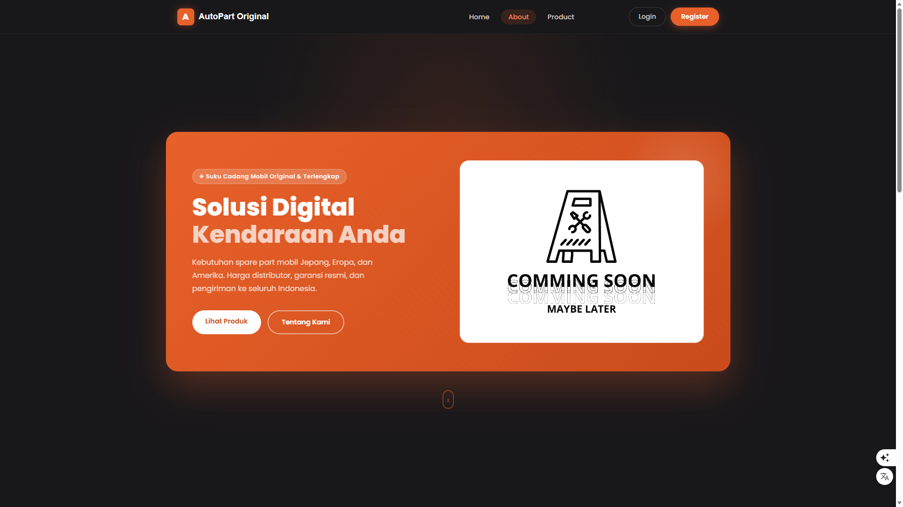

<p align="center">

</p>

<h1 align="center">Sistem Toko Online</h1>

<p align="center">
Aplikasi e-commerce berbasis <b>Laravel</b> & <b>Filament Admin</b>
</p>

<p align="center">


</p>

---

## 📌 Tentang Proyek

Aplikasi ini merupakan sistem toko online yang memungkinkan pengelolaan produk, keranjang belanja, dan proses checkout dengan pengurangan stok otomatis.

---
## Preview Aplikasi


---
## 🚀 Fitur Utama

✅ Manajemen Produk  
✅ Sistem Keranjang Belanja  
✅ Checkout satu item & massal  
✅ Pengurangan stok otomatis  
✅ Panel admin menggunakan Filament  
✅ Sistem verifikasi pembelian  

---

## 🛒 Modul Keranjang

Fitur keranjang memungkinkan pengguna:

- menambahkan produk ke keranjang
- melihat isi keranjang
- checkout produk
- validasi stok otomatis
- transaksi database untuk menjaga konsistensi data

---

## 🛠 Teknologi

- :contentReference[oaicite:0]{index=0}
- :contentReference[oaicite:1]{index=1}
- :contentReference[oaicite:2]{index=2}
- :contentReference[oaicite:3]{index=3}

---

## 📦 Instalasi

```bash
git clone https://github.com/username/nama-project.git
cd nama-project
composer install
cp .env.example .env
php artisan key:generate
php artisan migrate
npm install && npm run build
php artisan serve
